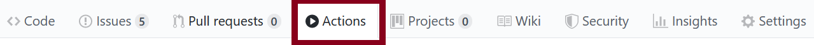

# Assignment — Brushing and Linking

This repository is your starting point for the assignment and includes the instructions below.

Link to your GitHub pages website: `[insert your *clickable* hyperlink here]`


# Aim of the assignment

This assignment will help you get started with brushing and linking which you will need for your project.
You will be creating a new table that is connected to the existing scatterplot and line chart using brushing and linking.

# Instructions
Please look through **all** the materials below so you understand the setup instructions; how to run, organize, and submit your code; and our requirements for the visualization.

## Setup

**Under no circumstances should you be editing files via the GitHub website user interface.** Do all your edits locally after cloning the repository. Commit major versions to your git repository.

1. Clone this repository to your local machine.
    E.g., in your terminal / command prompt `CD` to where you want this the folder for this activity to be. Then run `git clone <YOUR_REPO_URL>`

1. `CD` or open a terminal / command prompt window into the cloned folder.

1. Start a simple python webserver. E.g., `python -m http.server`, `python3 -m http.server`, or `py -m http.server`. If you are using python 2 you will need to use `python -m SimpleHTTPServer` instead, but please switch to python 3 as [Python 2 was sunset on 2020-01-01](https://www.python.org/doc/sunset-python-2/).

1. Wait for the output: `Serving HTTP on 0.0.0.0 port 8000 (http://0.0.0.0:8000/)`.

1. Now open your web browser (Firefox or Chrome) and navigate to the URL: http://localhost:8000

## Update hyperlinks

1. Edit near the top of this `README.md` file to include a clickable hyperlink to the GitHub pages website for your repo., replacing the `` `[insert your *clickable* hyperlink here]` `` code with your markdown. (Detailed instructions for GitHub pages [here](https://developer.mozilla.org/en-US/docs/Learn/Common_questions/Using_Github_pages).)

1. In `index.html` update the GitHub repo URL with the URL of your repository. It is in the span with `id='forkongithub'`.

## Organization

Here is an overview of the files and folders we provide for you in your repo.

### Root Files
* `README.md` is this explanatory file for the repo.

* `index.html` contains the main website content.

* `style.css` contains the CSS.

* `LICENCE` is the source code license for the template. You can add your name or leave it as is.

### Folders
Each folder has an explanatory `README.md` file.

* `data` holds the data file for the visualization, `texas.json`.

* `favicons` contains the favicons for the web page. You shouldn't change anything here.

* `.github` contains [GitHub Actions](https://github.com/features/actions) ([docs](https://docs.github.com/en/actions)) which will automatically validate your HTML, CSS, and hyperlinks when you push (see the [**validation last step** below](#validated)). **Do not edit files here** except to create new `.yml` files for any additional actions you choose to add (you are not required to make any).

* `img` contains a descriptive image for the `README.md`.

* `js` will contain all JavaScript files you write. E.g.,

  * `visualization.js` is the main code that builds all your visualizations.

  * `scatterplot.js` is the code for creating a scatterplot using a [Reusable Chart model](https://bost.ocks.org/mike/chart/).

  * `linechart.js` is the code for creating a line chart using a [Reusable Chart model](https://bost.ocks.org/mike/chart/).

* `lib` will contain any JavaScript library you use. It currently includes D3. To ensure long-term survivability, **use the included D3 here rather than linking to [d3js.org](https://d3js.org) or some other CDN.** Likewise, put your other libraries here rather than loading them from elsewhere.

## Table with Brushing and Linking

You will be creating a new table that is connected to the existing scatterplot and line chart using brushing and linking.
Make your edits and commit major versions to your git repository.
**Under no circumstances should you be editing files via the GitHub user interface.**

1. In `README.md` (this file) update the URL above with your actual GitHub pages URL.

1. In `index.html` update the GitHub repo URL with the URL of your repository. It is in the span with `id='forkongithub'`.

1. Create a new JavaScript file `js/table.js`.

1. Following the [Reusable Chart model](https://bost.ocks.org/mike/chart/) set out in `scatterplot.js` and `linechart.js`, write the code in `js/table.js` necessary for creating a table of all the data in `data/texas.json`. E.g., a header with the four columns for `year`, `poverty`, `unemployment`, and `murder` followed by `22` rows of data like so:

    | year | poverty | unemployment | murder |
    |-----:|--------:|-------------:|-------:|
    | 1996 | 16.6    | 7.7          | 5.7    |
    | 1997 | 16.7    | 6.8          | 5.3    |
    | ...  | ...     | ...          | ...    |

1. Add the necessary `<div>` code to `index.html` to place your table directly below the existing visualizations.

1. Add any necessary CSS to `style.css` for displaying your table.

1. Add code to `js/visualization.js` to create your table in the appropriate `<div>`. It should be of a set height. E.g., it should not resize as you select elements. You may need a scroll bar.

1. Add brushing and highlighting functionality to your table to match both function and style of the scatterplot and line chart.

1. Add code to `js/visualization.js` to create the three-way brushing and linking between the table, line chart, and scatterplot. E.g., selections in any of the three should highlight the associated data marks in **all three** visualizations.

1. <a name='validated'></a> Ensure your code passes the 'Validate HTML, CSS, and Links' checks we run when you push to GitHub. I.e., you want to see a green check next to your commit
  (<svg width='16' height='16' role='img'><path stroke='#22863a' d='M13.78 4.22a.75.75 0 010 1.06l-7.25 7.25a.75.75 0 01-1.06 0L2.22 9.28a.75.75 0 011.06-1.06L6 10.94l6.72-6.72a.75.75 0 011.06 0z'></path></svg>)
  and not a red X
  (<svg width='16' height='16' role='img'><path stroke='#cb2431' d='M3.72 3.72a.75.75 0 011.06 0L8 6.94l3.22-3.22a.75.75 0 111.06 1.06L9.06 8l3.22 3.22a.75.75 0 11-1.06 1.06L8 9.06l-3.22 3.22a.75.75 0 01-1.06-1.06L6.94 8 3.72 4.78a.75.75 0 010-1.06z'></path></svg>).
You can also see the results in the Actions tab of your repo:


The final interaction should look like this (without the concentric red rings on click):


# Academic integrity
You are welcome to use D3 tutorials or resources as a starting point for your code.
However, **you must cite and reference the resources or sample code you use and explain how you use them**.
***This includes anything from [bl.ocks.org](https://bl.ocks.org/), [Observable](https://observablehq.com/@d3/gallery), or [Stack Overflow](https://stackoverflow.com/)!***
Failure to properly cite and attribute code is a breach of academic honesty.
Also, per our syllabus, homework is an individual assessment and should be completed by you alone.
Simply copying existing examples without performing thoughtful edits is a breach of academic honesty.
You are welcome to ask fellow classmates and students for help and discuss the assignment, but **the submission should be your own work**.
***See [the syllabus](https://northeastern.instructure.com/courses/18721) for much more detail on our academic integrity policy and expectations.***

# Submission instructions

1. Ensure you updated (1) the GitHub Pages URL at the top of this `README.md` file and (2) the GitHub repository URL in `index.html` in the span with `id='forkongithub'`.

1. Commit all your local files and push them to the remote repository on GitHub which was generated by GitHub Classroom. We will grade based on what is visible on the GitHub Page.

1. Submit the URL of **your GitHub Classroom-generated repository** (not your GitHub Page) to [the associated assignment on Canvas](https://northeastern.instructure.com/courses/18721/assignments/573835). **Do not submit a link to a personal repository. It must be within our class GitHub organization.**

# Tips, tricks, and troubleshooting

See https://github.com/NEU-DS-4200-F20-Staff/General_Course_Information/blob/master/d3.md

## How to write a table to the DOM using D3

D3 is not just an SVG data binding and manipulation library, though that is what most of the examples show.
It is actually a general-purpose DOM data binding and manipulation library.
You can thus use it to manipulate arbitrary HTML tags too, e.g., the tags for tables: `<table>`, `<thead>`, `<tbody>`, `<tr>`, `<th>`, `<td>`.

You can [search for at examples online](https://www.google.com/search?&q=d3+html+table), e.g., Jonah Williams' [Interactive HTML Table I](http://bl.ocks.org/jonahwilliams/cc2de2eedc3896a3a96d).
Note that this is using D3 version 3 while you are using D3 version 6, so some changes may be necessary.
**Make sure to cite any materials you use.**

## How to implement interaction on the table

[`d3.brush`](https://github.com/d3/d3-brush) would be hard to use directly atop an HTML `table`. Instead, think about how you can re-create similar functionality by listening for DOM events. D3's `d3-selection` module can listen for any of the [standard DOM events](https://github.com/d3/d3-selection#handling-events) using the `selection.on(typenames[, listener[, options]])` function.

E.g., to provide row highlighting on mouseover a la Jonah Williams' [Interactive HTML Table I](http://bl.ocks.org/jonahwilliams/cc2de2eedc3896a3a96d) you can listen for [Mouse Events](https://developer.mozilla.org/en-US/docs/Web/Events#Mouse_events) like so (with D3v6):

```js
d3.selectAll('tr')
    .on('mouseover', (event, d) => {
      d3.select(event.currentTarget).classed('highlighted', true);
    })
    .on('mouseout', (event, d) => {
      d3.select(event.currentTarget).classed('highlighted', false);
    });
```

There are some major differences with D3v6 vs. previously. See, e.g,. [this thread on StackOverflow](https://stackoverflow.com/questions/63693132/unable-to-get-node-datum-on-mouseover-in-d3-v6) and [the migration guide](https://observablehq.com/@d3/d3v6-migration-guide#events).

### How we are sending selection updated events

The d3-dispatch module [`d3-dispatch`](https://github.com/d3/d3-dispatch) is made for emiting and listening for events, which we use to coordinate selection updates between our linked views.

E.g.,
```js
let dispatcher = d3.dispatch('selectionUpdated');
dispatcher.on('selectionUpdated', callback1);
```
where `callback1` is a callback function for when the event happens.
However, to have multiple listeners for that same event you would need to have unique suffixes for the same string beginning with '`.`'.
E.g., to have both the line chart and table listening to scatterplot updates we could have
```js
dispatcher.on('selectionUpdated.sp-to-lc', callback1);
dispatcher.on('selectionUpdated.sp-to-tab', callback1);
```
where `'sp-to-lc'` and `'sp-to-tab'` are arbitrary but written here to be informative.

# Assignment setup (for instructors only)

See https://github.com/NEU-DS-4200-F20-Staff/General_Course_Information/blob/master/assignment-setup.md